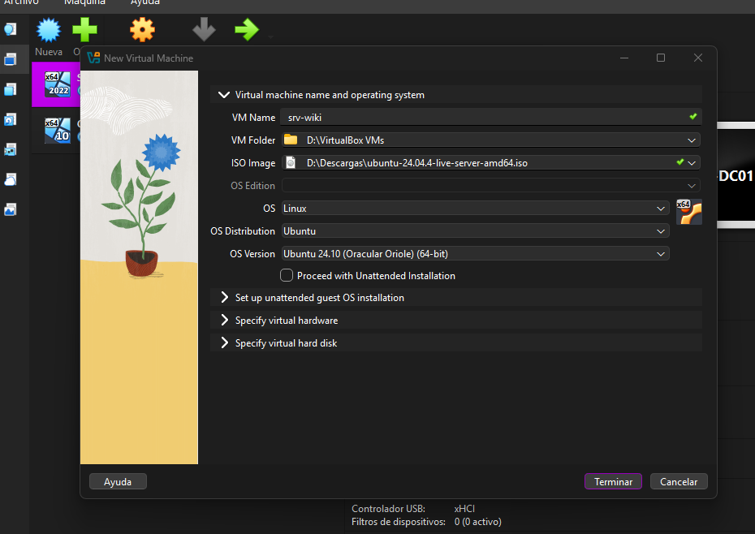
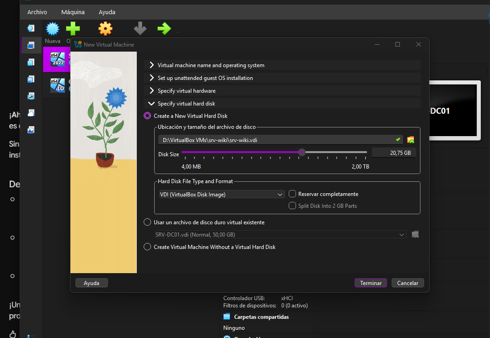
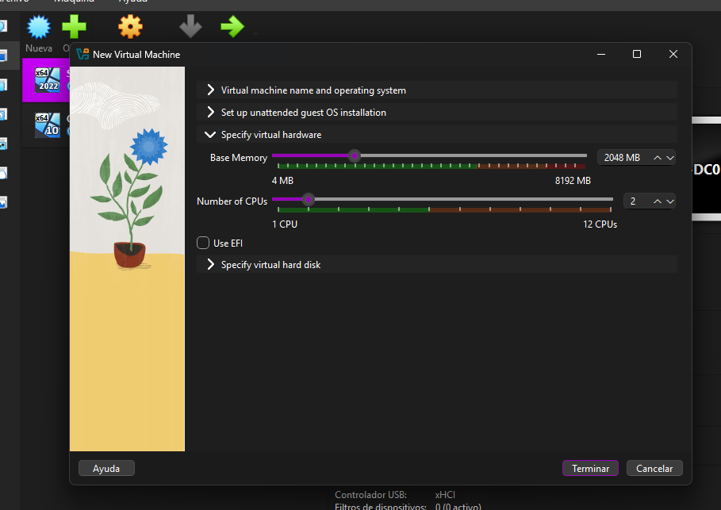

# Wiki — Laboratorio Linux Server (TI3V35)

**Estudiante:** Maribel Natalia González Fuentes
**Asignatura:** TI3V35 — Sistemas Operativos
**Docente:** Rubén Schnettler Lucero
**Unidad:** 3 — Sistema Operativo Linux Server (Ubuntu Server 24.04 LTS)
**Evaluación:** Sumativa N°3 — Ponderación 35 % de la nota final

## Objetivo del laboratorio

Montar, administrar y hardenizar un servidor **Ubuntu Server 24.04 LTS** en VirtualBox, gestionado
exclusivamente **por línea de comandos** (sin escritorio), aplicando configuración básica de red y
firewall, gestión de permisos, uso de gestores de paquetes, e instalación de **nginx** para publicar
un sitio web servido desde el propio servidor.

## Topología del laboratorio

```
TU PC (anfitrión)                          VM: srv-wiki (Ubuntu Server 24.04 · red NAT)

navegador  http://localhost:8080  ────▶    nginx (puerto 80)  →  /var/www/wiki
terminal   ssh -p 2222 inacap@localhost ─▶  SSH (puerto 22)
```

La VM sale a internet por **NAT** (necesario para `apt`). El **reenvío de puertos** de VirtualBox
conecta el PC anfitrión con el servidor: `8080 → 80` (web) y `2222 → 22` (SSH).

| Parámetro       | Valor            |
|-----------------|-------------------|
| Nombre de la VM | srv-wiki          |
| Sistema         | Ubuntu Server 24.04 LTS |
| RAM asignada    | 2 GB              |
| Disco           | 25 GB             |
| Usuario         | inacap            |
| Adaptador de red| NAT               |

## Recorrido de la wiki

Esta wiki documenta el laboratorio en cinco bloques (A–E), cada uno correspondiente a un criterio
de evaluación de la pauta de cotejo, más la bitácora de uso de IA:

1. **Licencias** (3.1.1) — Software libre y tipos de licenciamiento.
2. **Instalación** (3.1.2) — Hostname, IP, actualizaciones y firewall (UFW).
3. **Permisos** (3.1.3) — Gestión de archivos y permisos por CLI.
4. **Paquetes** (3.1.4) — Gestores de paquetes con `apt`.
5. **Nginx** (3.1.4) — Instalación de nginx y despliegue del sitio.
6. **Prompts** — Bitácora de uso de IA durante el desarrollo.

> Captura de referencia (topología / VM creacion paso a paso en VirtualBox):







