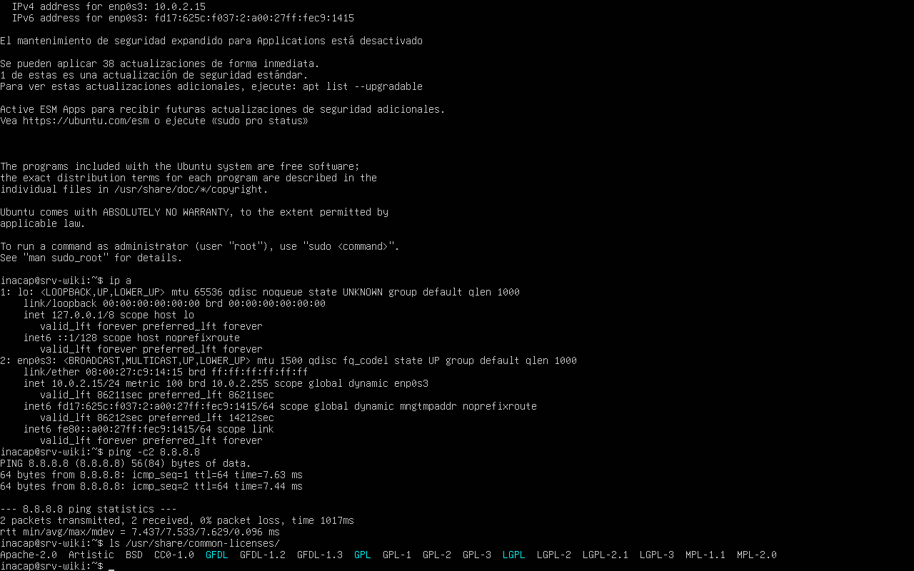
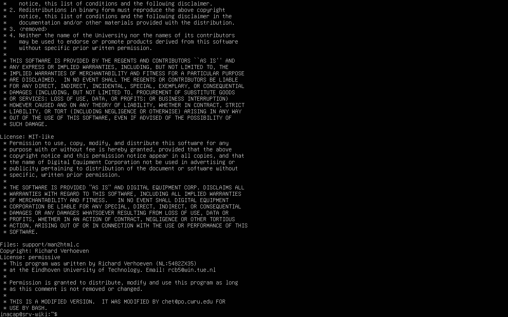

# 3.1.1 — Software libre y licenciamiento

## Comandos ejecutados en el servidor

```bash
ls /usr/share/common-licenses/
less /usr/share/common-licenses/GPL-3   # salir con: q
cat /usr/share/doc/bash/copyright
```

`ls /usr/share/common-licenses/` lista todos los textos de licencia que Ubuntu incluye de fábrica
(GPL, LGPL, MIT, BSD, Apache, etc.), porque cada paquete del sistema debe declarar bajo qué licencia
se distribuye. `less` permite leer el texto completo de la licencia GPL-3 página por página. `cat
/usr/share/doc/bash/copyright` muestra bajo qué licencia específica se distribuye el paquete `bash`.






## ¿Qué es el software libre?

El software libre es aquel que otorga a la persona usuaria cuatro libertades básicas: ejecutarlo con
cualquier propósito, estudiar y modificar su código fuente, redistribuirlo, y distribuir versiones
modificadas. Esto se garantiza mediante una **licencia** que acompaña el código fuente.

## Tipos de licenciamiento

| Tipo | Ejemplos | Característica principal |
|------|----------|---------------------------|
| **Copyleft (libre)** | GPL, LGPL, AGPL | Exige que cualquier trabajo derivado se distribuya bajo la misma licencia. Protege la libertad "hacia adelante". |
| **Permisiva** | MIT, BSD, Apache 2.0 | Permite reutilizar, modificar y redistribuir el código, incluso en software propietario, con mínimas restricciones (generalmente solo mantener el aviso de copyright). |
| **Propietaria** | Windows, software comercial cerrado | El código fuente no se distribuye; el uso está restringido por un contrato/licencia comercial y normalmente prohíbe modificar o redistribuir. |

## Relación con la distribución y herramientas utilizadas

- **Ubuntu** es un sistema operativo compuesto por miles de paquetes con licencias distintas: el
  **kernel Linux** se distribuye bajo **GPLv2**, gran parte de las herramientas GNU (bash, coreutils)
  bajo **GPLv3**, y muchas librerías del sistema bajo licencias permisivas como **MIT** o **BSD**.
  Ubuntu en su conjunto es una distribución de software libre y de código abierto.
- **nginx**, el servidor web usado en este laboratorio, se distribuye bajo licencia **BSD de 2
  cláusulas** (permisiva), lo que permite su uso comercial y modificación libre.
- El propio proyecto de esta wiki (React + Vite) utiliza librerías de código abierto licenciadas
  mayoritariamente bajo **MIT**.

**¿Bajo qué tipo de licencia está Ubuntu?** Ubuntu no tiene una única licencia: es una colección de
miles de paquetes, cada uno con su propia licencia (mayormente GPL, LGPL, MIT y BSD), todas
compatibles con la definición de software libre.
