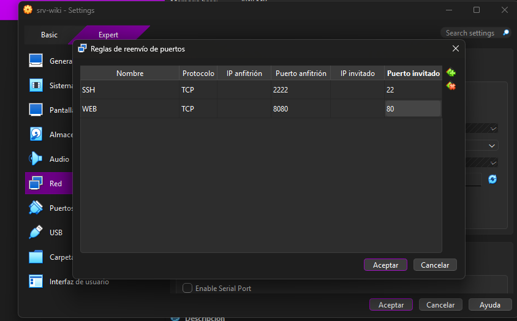
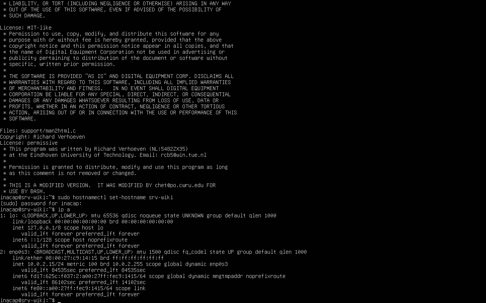
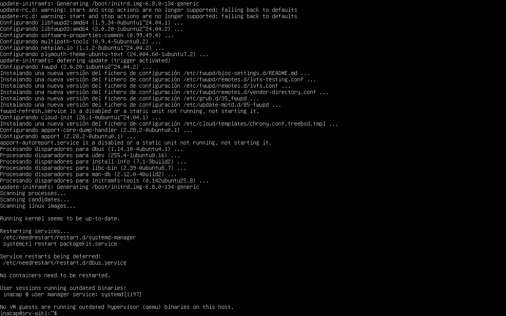
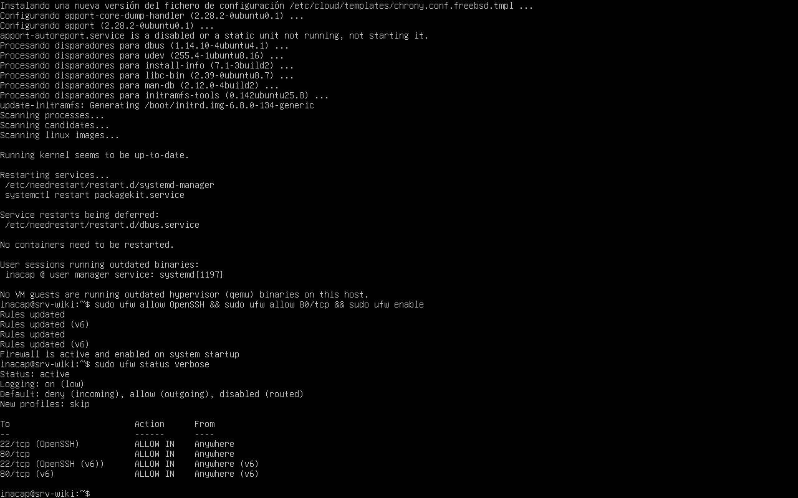

# 3.1.2 — Instalación y configuración básica

## 1. Creación de la VM

VM `srv-wiki`, Ubuntu 64-bit, 2 GB RAM, 25 GB de disco. Adaptador de red 1 → **NAT** → Avanzado →
Reenvío de puertos: `ssh 2222→22` y `web 8080→80`. Instalación de Ubuntu Server con usuario `inacap`,
server name `srv-wiki`, marcando **"Install OpenSSH server"**.



## 2. Conexión por SSH

```bash
ssh -p 2222 inacap@localhost
```

Desde el PC anfitrión, este comando abre una sesión SSH contra el puerto 22 de la VM, tunelizado a
través del puerto 2222 del host gracias al reenvío de puertos configurado en VirtualBox.

## 3. Hostname, IP, actualizaciones y firewall

```bash
sudo hostnamectl set-hostname srv-wiki
ip a
sudo apt update && sudo apt upgrade -y
sudo ufw allow OpenSSH && sudo ufw allow 80/tcp && sudo ufw enable
sudo ufw status verbose
```

**Traducción comando a comando:**

- `sudo hostnamectl set-hostname srv-wiki` — define el nombre del equipo (hostname) como `srv-wiki`,
  con privilegios de administrador (`sudo`).
- `ip a` — muestra las interfaces de red del sistema y sus direcciones IP asignadas (en este caso, la
  IP asignada por DHCP dentro de la red NAT de VirtualBox).
- `sudo apt update` — sincroniza el índice local de paquetes disponibles con los repositorios
  configurados. `sudo apt upgrade -y` — instala las actualizaciones disponibles para los paquetes ya
  instalados, confirmando automáticamente (`-y`).
- `sudo ufw allow OpenSSH` — agrega una regla de firewall (UFW, *Uncomplicated Firewall*) que permite
  el tráfico entrante al servicio SSH (puerto 22). `sudo ufw allow 80/tcp` — permite el tráfico
  entrante al puerto 80/TCP (HTTP, para nginx). `sudo ufw enable` — activa el firewall con las reglas
  definidas.
- `sudo ufw status verbose` — muestra el estado del firewall y el detalle de todas las reglas activas.

> ⚠️ Es fundamental abrir la regla de OpenSSH **antes** de ejecutar `ufw enable`; de lo contrario, se
> pierde el acceso remoto por SSH al activarse el firewall sin esa regla.







## Investigación

**¿Qué es NAT?** *Network Address Translation*: mecanismo que permite que la VM comparta la conexión
a internet del PC anfitrión, traduciendo las direcciones IP privadas de la VM a la IP pública del host
para salir a internet (necesario para que `apt` pueda descargar paquetes).

**¿Para qué el reenvío de puertos?** Como la VM vive en una red NAT interna y aislada, el PC anfitrión
no puede alcanzarla directamente. El reenvío de puertos (*port forwarding*) redirige un puerto del
host (ej. 8080) hacia un puerto de la VM (ej. 80), permitiendo acceder a servicios internos de la VM
desde el navegador o terminal del anfitrión.

**¿DHCP vs IP fija?** Con **DHCP**, la IP se asigna automáticamente y puede cambiar entre reinicios;
es simple pero menos predecible. Con **IP fija (estática)**, la dirección se configura manualmente y
no cambia, lo cual es preferible en un servidor para mantener siempre la misma dirección accesible.
