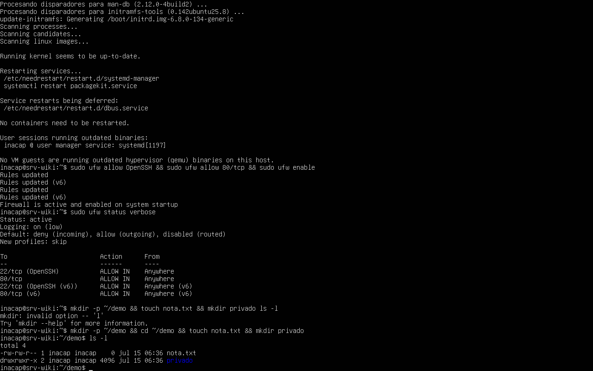
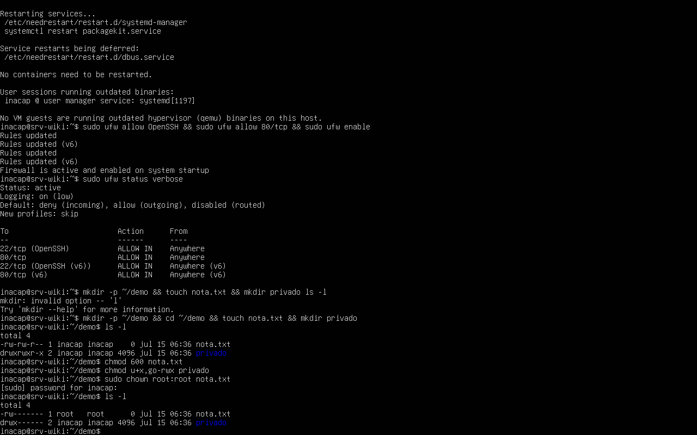
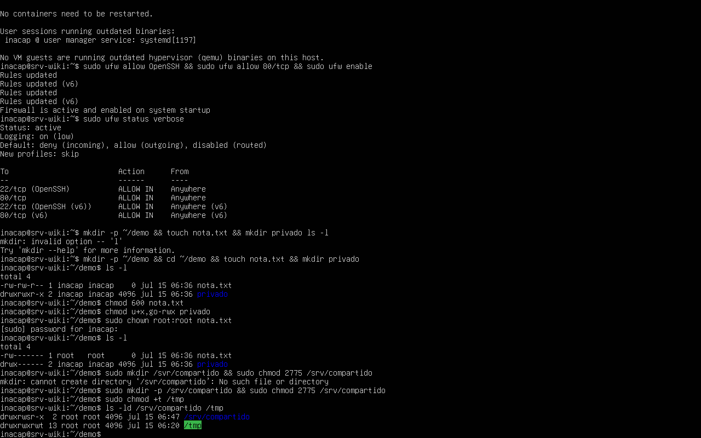

# 3.1.3 — Gestión de archivos y permisos por CLI

## Comandos ejecutados

```bash
mkdir -p ~/demo && cd ~/demo && touch nota.txt && mkdir privado
ls -l
chmod 600 nota.txt
chmod u+x,go-rwx privado
sudo chown root:root nota.txt
sudo mkdir /srv/compartido && sudo chmod 2775 /srv/compartido
sudo chmod +t /tmp
ls -ld /srv/compartido /tmp
```







## Cómo se lee `-rw-rw-r--`

La salida de `ls -l` muestra 10 caracteres por archivo: el primero indica el tipo (`-` archivo,
`d` directorio), y los 9 restantes se agrupan en tres bloques de 3 (**propietario / grupo / otros**),
cada uno con permisos de **lectura (r), escritura (w) y ejecución (x)**. Así, `-rw-rw-r--` significa:
propietario lee y escribe, grupo lee y escribe, otros solo leen.

## `chmod` numérico vs simbólico

- **Numérico**: cada permiso vale r=4, w=2, x=1; se suman por bloque (dueño–grupo–otros). Ej.:
  `chmod 600 nota.txt` deja el archivo con `rw-------` (solo el dueño lee y escribe, nadie más tiene
  acceso).
- **Simbólico**: se indica con letras quién (`u`=usuario, `g`=grupo, `o`=otros, `a`=todos), la
  operación (`+` agrega, `-` quita, `=` asigna) y el permiso (`r`, `w`, `x`). Ej.:
  `chmod u+x,go-rwx privado` agrega ejecución al dueño y quita todos los permisos a grupo y otros.

## `chown`

`chown` cambia el **propietario** y/o **grupo** de un archivo o carpeta. `sudo chown root:root
nota.txt` traspasa el archivo `nota.txt` para que pertenezca al usuario `root` y al grupo `root`.

## Permisos especiales: `setgid` y `sticky bit`

- **setgid** (bit `s` en el permiso de grupo, ej. `chmod 2775`): aplicado a un directorio, hace que
  todo archivo nuevo creado dentro herede automáticamente el **grupo** del directorio padre, en vez
  del grupo por defecto del usuario que lo crea. Útil para carpetas compartidas entre varios usuarios
  de un mismo grupo (como `/srv/compartido`).
- **sticky bit** (bit `t` en el permiso de otros, ej. `chmod +t /tmp`): aplicado a un directorio con
  permisos de escritura para todos (como `/tmp`), impide que un usuario pueda borrar o renombrar
  archivos de otros usuarios dentro de esa carpeta; solo el dueño del archivo (o root) puede
  eliminarlo, aunque todos puedan escribir en el directorio.
