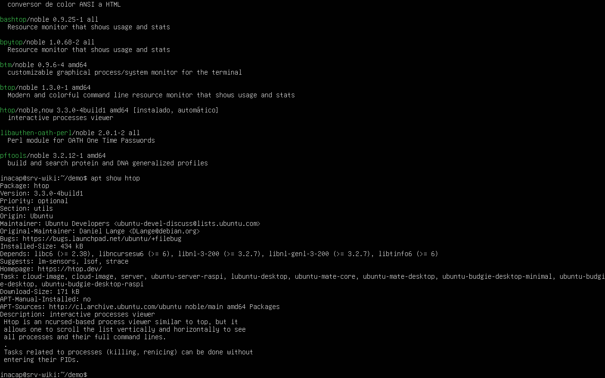
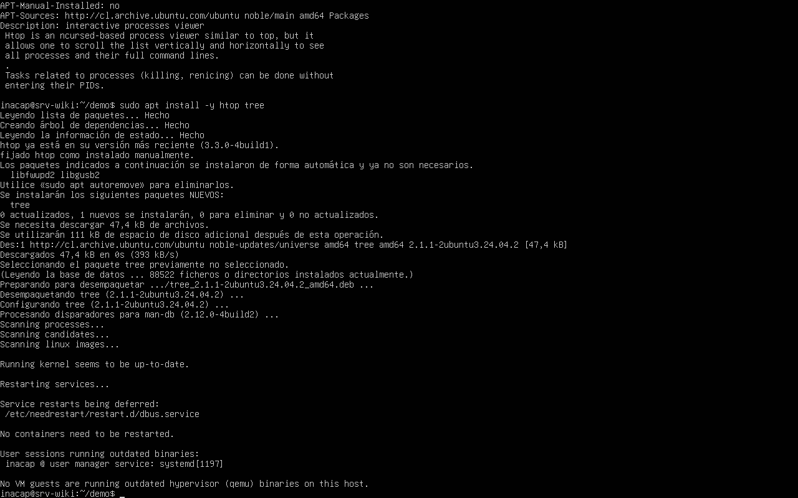

# 3.1.4 — Gestores de paquetes (apt)

## Comandos ejecutados

```bash
apt search htop
apt show htop
sudo apt install -y htop tree
```





## El flujo `update → search → show → install`

1. **`apt update`** — sincroniza el índice local con los repositorios configurados; sin este paso, el
   sistema podría no conocer versiones nuevas o paquetes recién publicados.
2. **`apt search <término>`** — busca en ese índice local paquetes cuyo nombre o descripción coincidan
   con el término, sin instalar nada.
3. **`apt show <paquete>`** — muestra el detalle de un paquete específico: versión, tamaño, dependencias,
   descripción y desde qué repositorio se instalaría.
4. **`apt install <paquete>`** — descarga e instala el paquete junto con sus dependencias necesarias.

## Caso práctico: "necesito un monitor del sistema"

Ante la necesidad de monitorear CPU, memoria y procesos en el servidor, se compararon tres
alternativas disponibles en los repositorios de Ubuntu:

| Alternativa | Peso aprox. | Dependencias | Ventaja | Desventaja |
|---|---|---|---|---|
| **htop** | ~200 KB | mínimas (ncurses) | Interfaz interactiva, liviana, estándar en la industria | Solo consola |
| **top** | ya viene instalado | ninguna | Cero instalación | Interfaz menos clara, no interactiva con mouse |
| **glances** | ~1-2 MB | Python + varias librerías | Muy completo (red, disco, alertas) | Más pesado, más dependencias, overhead innecesario para un servidor mínimo |

**Elección justificada:** se instaló **`htop`** porque ofrece la mejor relación entre utilidad y
costo: es liviano, tiene pocas dependencias, es interactivo (permite ordenar y matar procesos desde
la misma interfaz) y es una herramienta estándar en administración de servidores Linux, lo que
resuelve la necesidad concreta sin sobrecargar un servidor con recursos limitados (2 GB de RAM). Este
es el criterio de **factibilidad**: no se elige la herramienta más completa, sino la más adecuada
para el contexto (servidor mínimo, sin escritorio, recursos acotados).
